# Top 15 Best Social Listening Tools in 2025

You're posting content, running campaigns, maybe even going viral occasionally—but here's the uncomfortable question: do you actually know what people are saying about your brand when you're not in the room? The conversations happening right now on Reddit, TikTok comments, industry forums, and review sites contain the brutal truth about your products, the praise you're missing, and the complaints turning into PR fires before you even notice. Social listening tools fix this blindspot by monitoring millions of online sources in real-time, catching mentions whether you're tagged or not.

The platforms below don't just count how many times someone tweets your brand name—they analyze sentiment, identify influencers spreading your message, track competitor movements, and alert you to emerging crises before they explode. Whether you need basic brand monitoring for a startup or enterprise-grade media intelligence covering 850 million sources daily, these tools transform social noise into strategy that actually moves business metrics. The right social listening software lets you stop guessing what customers think and start acting on what they're actually saying.

---

## **[Brand24](https://brand24.com/)**

The AI-powered social listening platform delivering real-time access to 25 million online sources with advanced sentiment analysis, specifically built for brands needing comprehensive monitoring without enterprise complexity.

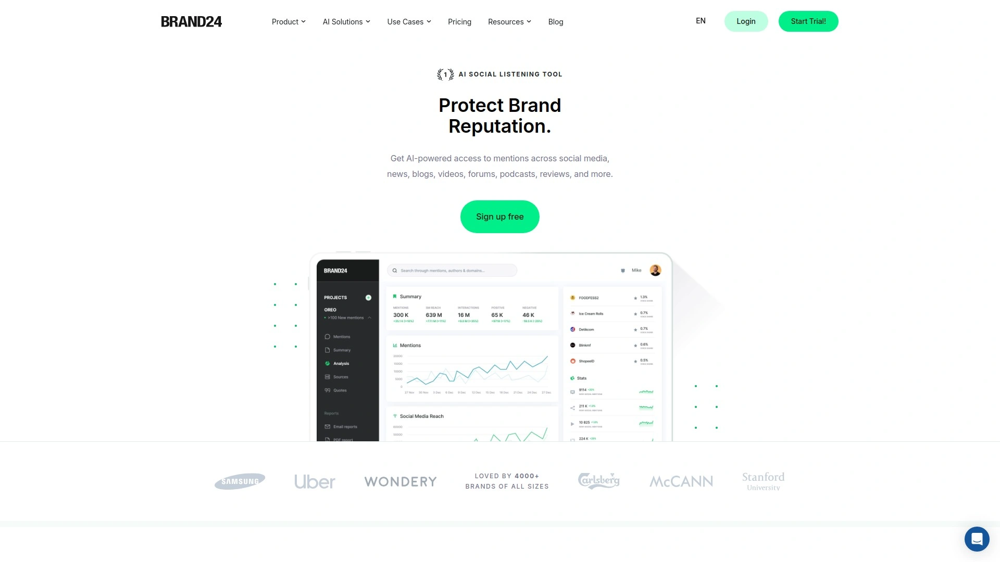

Brand24 tracks mentions across social media, news sites, blogs, videos, forums, podcasts, reviews, and more—covering essentially every public online space where conversations happen. The platform uses AI-powered sentiment analysis to automatically categorize mentions as positive, negative, or neutral, and it genuinely handles sarcasm detection rather than just counting keywords. This saves hours of manual review when you're processing hundreds or thousands of mentions daily.

The Discussion Volume Chart visualizes mention patterns over time, making it immediately obvious when something unusual is happening—a viral moment, emerging crisis, or successful campaign gaining traction. Presence Score quantifies your brand's online visibility by measuring reach and engagement using their proprietary technology. The Influence Score identifies which mentions actually matter by filtering out noise and highlighting high-impact conversations from influential accounts or widely-read publications.

Hashtag tracking measures campaign performance with metrics like reach, engagement, and mention volume tied to specific hashtags. The platform generates automated reports you can schedule and share with teams or clients, eliminating manual data compilation. With support for analyzing over 100 languages, it works for global brands monitoring multiple markets simultaneously.

Brand24 positions itself as the accessible option for small to medium businesses and consultants who need professional-grade monitoring at reasonable pricing. The interface focuses on speed and usability—you can set up monitoring projects in minutes rather than requiring extensive configuration. Users consistently mention how the tool surfaces actionable insights quickly, particularly valuable for agencies managing multiple client accounts who need efficient workflows. It integrates with reporting tools and marketing platforms, fitting into existing workflows without forcing major process changes.

***

## **[Hootsuite](https://www.hootsuite.com)**

The comprehensive social media management platform combining publishing, engagement, analytics, and listening capabilities, now enhanced with AI-powered insights after acquiring NewsWhip for predictive intelligence.

Hootsuite provides end-to-end social media management where listening integrates directly with the workflow tools teams already use daily. The social listening features monitor conversations across platforms, tracking brand mentions, hashtags, keywords, and competitor activity in real-time. What sets it apart is how listening data flows directly into the unified inbox, making it seamless to spot a concerning mention and respond immediately without switching between tools.

The platform now includes Talkwalker's advanced listening technology through acquisition, adding visual recognition that spots your brand logo in images and videos even when you're not explicitly mentioned. The Yeti AI assistant, built into the interface, helps users pull insights quickly by answering questions in natural language—"Show me negative sentiment trends this week" or "Which competitors are gaining share of voice?". AI summarization condenses lengthy conversation threads into digestible insights without hours of reading.

Publishing and scheduling tools connect 20+ social networks in one interface, with bulk scheduling, content calendar views, and suggested optimal posting times based on historical engagement. Analytics dashboards provide cross-platform performance metrics with customizable reporting. Team collaboration features include approval workflows, role-based permissions, and assignment capabilities for distributed teams.

Hootsuite serves over 200,000 customers globally, from small businesses to enterprises like McDonald's and Allianz. The pricing scales from individual plans to enterprise packages for large organizations managing hundreds of social accounts. It's particularly strong for marketing teams needing comprehensive social management where listening, publishing, engagement, and reporting happen in one ecosystem rather than juggling separate point solutions. The learning curve exists due to feature breadth, but onboarding resources and customer support help teams get productive quickly.

---

## **[Sprout Social](https://sproutsocial.com)**

The unified social media platform emphasizing analytics depth and customer care integration, with embedded listening widgets directly in reporting dashboards so insights connect immediately to action.

Sprout Social delivers high-impact listening built into a fully unified platform where insights flow directly into Smart Inbox, automated workflows, and Premium Analytics—teams act without switching tools. Listening widgets embed in Premium Analytics dashboards, giving teams a complete view of brand health, campaign performance, and competitive activity in one place without requiring analyst expertise. This integration is genuinely valuable when you need to see how a spike in negative sentiment correlates with customer service volume or campaign timing.

The recent NewsWhip acquisition adds predictive intelligence that detects critical signals earlier by combining media and social landscape data. This helps teams anticipate trending topics before they peak, positioning brands to contribute meaningfully to conversations rather than reacting late. AI-powered analysis automatically surfaces key takeaways from performance data, accelerating time from raw metrics to actionable decisions.

Publishing capabilities support major platforms including TikTok, Instagram Reels, and Threads with native integrations. The ViralPost feature analyzes historical data to recommend optimal posting times for maximum engagement. Customer care tools consolidate messages across networks into a unified inbox with case management, assignment rules, and response time tracking. CRM integrations with Zendesk, HubSpot, Salesforce, and Microsoft Dynamics 365 connect social activity to broader customer journey data.

Sprout serves over 30,000 customers and releases 100+ material product updates annually, maintaining strong innovation velocity. On G2, it scores 8.1 for social listening compared to competitors' lower ratings, reflecting customer satisfaction with both ease of use and impact. Pricing targets mid-market to enterprise customers, starting around $249/month for the Standard plan with fuller feature access at higher tiers. It's ideal for brands prioritizing customer experience and data-driven strategy who want listening tightly integrated with engagement and analytics.

***

## **[Brandwatch](https://www.brandwatch.com)**

The enterprise-grade consumer intelligence platform offering integrated social listening, influencer marketing, and consumer research with sampling-based data suitable for global PR and marketing teams.

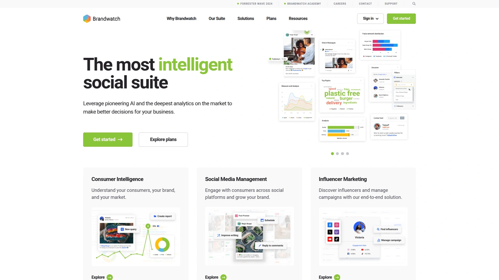

Brandwatch provides comprehensive media monitoring where social listening combines with influencer identification and consumer research insights in one platform. The system processes massive data volumes using sampling methodologies that provide statistically significant insights without tracking every single mention—an approach that works well for brand health tracking and trend analysis across markets. This differs from real-time alerting tools, making it better suited for strategic analysis than immediate response.

Consumer research capabilities tap into online conversations to understand audience preferences, pain points, and emerging needs. The platform segments data demographically and psychographically, revealing how different audience groups perceive your brand differently. Influencer marketing tools identify key voices in your space, analyze their audience quality and engagement rates, and track campaign performance when you activate influencer partnerships.

Image recognition technology spots visual brand appearances in photos and videos across social platforms, catching logo placements, product usage, and visual brand sentiment. Historical data access provides context for current trends, letting teams understand whether current mention volumes are normal or anomalous. Custom dashboards and reporting serve stakeholder needs from executives wanting high-level summaries to analysts needing granular data exploration.

The platform serves enterprise clients including Unilever, Dell, and British Airways who need enterprise support, data governance, and sophisticated segmentation. Implementation requires dedicated onboarding and training—this isn't a tool you sign up for and start using in an afternoon. Pricing reflects enterprise positioning and typically isn't publicly listed, requiring custom quotes. It's strongest for large organizations with PR, social, and research teams who need unified consumer intelligence rather than just real-time monitoring.

***

## **[Meltwater](https://www.meltwater.com)**

The media intelligence platform combining earned media monitoring with social listening, particularly strong for PR professionals needing Chinese social platform coverage and traditional media tracking.

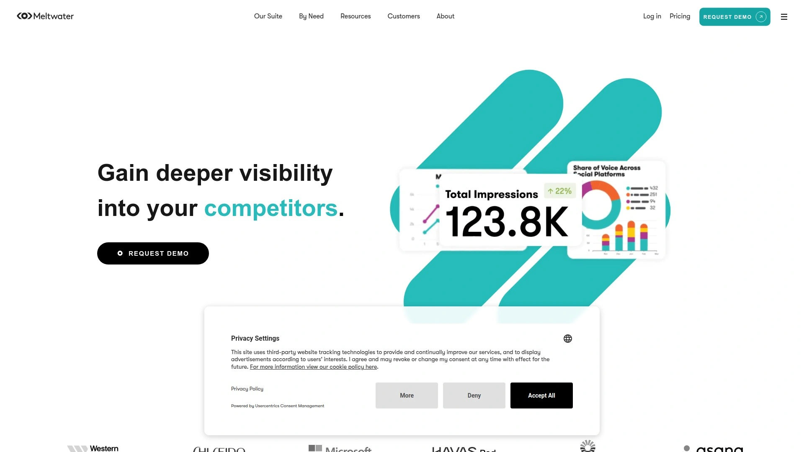

Meltwater monitors both traditional media (news sites, broadcasts, print) and social media in one system, making it comprehensive for PR teams tracking earned media value alongside social conversations. The platform covers over 270,000 global news sources plus social networks, forums, and blogs. This breadth matters when your press release generates news coverage that then triggers social discussion—you see the entire cascade in one place.

Chinese social platform coverage including Weibo, WeChat, and Xiaohongshu (RED) sets Meltwater apart from Western-focused competitors. For brands operating in Asian markets or global brands monitoring international conversations, this coverage is genuinely valuable. The platform includes Boolean search capabilities for building complex monitoring queries that capture relevant conversations while filtering noise.

Media contact databases help PR teams identify and reach journalists, bloggers, and influencers relevant to their industry. Campaign monitoring tracks how announcements and initiatives perform across earned and social media with reach and engagement metrics. Competitive intelligence features benchmark your media presence against competitors, showing share of voice, sentiment comparison, and message effectiveness.

The interface receives mixed reviews—some users find it clunky compared to newer tools, and the social media management features are described as less reliable than dedicated social tools. However, for media intelligence and PR measurement, the functionality is solid. Pricing isn't publicly listed and requires custom enterprise quotes. It's particularly suitable for PR agencies, corporate communications teams, and brands with significant international presence needing both traditional and social media monitoring.

***

## **[Mention](https://mention.com)**

The affordable real-time monitoring tool providing instant alerts, sentiment tracking, and simple dashboards designed for small to medium teams and agencies needing cost-effective multi-language tracking.

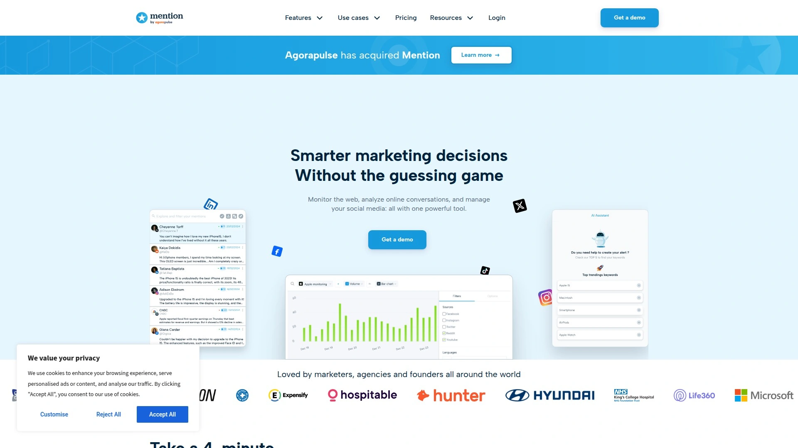

Mention delivers real-time alerts whenever your brand, competitors, or tracked keywords are mentioned online across web and social sources. The alert speed is genuinely fast—notifications arrive within minutes of publication, making it suitable when immediate response matters for customer service or crisis management. You can set up monitoring for unlimited keywords and receive alerts via email, mobile push, or Slack integration.

Multi-language monitoring supports tracking in numerous languages without requiring separate setup for each, valuable for brands operating in multiple markets. The sentiment analysis categorizes mentions as positive, negative, or neutral automatically, and you can adjust the algorithm's assessment when it misreads context. Mention tracking happens across social networks, news sites, blogs, forums, and essentially any publicly accessible web content.

The dashboard provides at-a-glance metrics including mention volume, sentiment breakdown, reach, and top sources driving conversations. Filtering options let you narrow results by sentiment, language, source type, or date range to focus on what matters. Collaboration features allow team members to assign mentions, add internal notes, and track which messages received responses.

Mention positions itself as the accessible option with transparent pricing starting around $29/month for basic plans, scaling to $99/month for professional features with more mentions and alerts included. API access enables custom integrations for teams wanting to feed mention data into their own systems. It's particularly suitable for startups, small businesses, digital agencies managing multiple clients, and consultants who need reliable monitoring without enterprise costs. The interface is clean and easy to learn, requiring minimal onboarding time.

***

## **[Talkwalker](https://www.talkwalker.com)**

The AI-powered consumer intelligence platform emphasizing visual analytics, trend forecasting, and multilingual listening across 150 million sources, now integrated with Hootsuite for seamless action on insights.

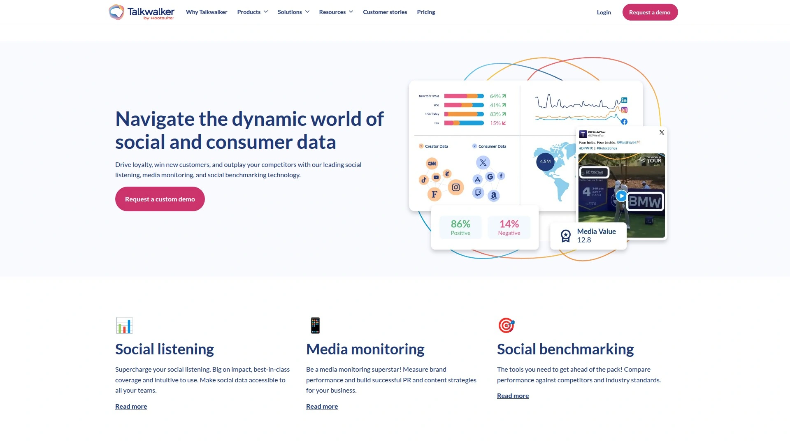

Talkwalker processes over 150 million sources globally with image and video recognition technology that identifies your brand in visual content even without text mentions. This visual listening is particularly valuable for consumer brands where product placement, user-generated content, and visual brand presence matter significantly. The AI can spot logos, products, and brand-related imagery across Instagram, TikTok, YouTube, and other visual-heavy platforms.

The Yeti AI assistant is built directly into the platform, available to any user immediately without additional setup. You can ask Yeti questions in natural language to pull specific insights, generate reports, or analyze trends without learning complex query languages. Yeti Studio lets you customize the AI assistant around your brand's specific needs, terminology, and reporting preferences. AI summarization across dashboard widgets condenses lengthy reports into digestible insights automatically.

Quick Search enables rapid investigation of emerging topics without setting up formal monitoring projects—type in a keyword and instantly see current conversation volume, sentiment, and key influencers. Trend forecasting uses predictive analytics to identify topics gaining momentum before they peak, giving brands time to prepare responses or capitalize on opportunities. The platform provides two years of historical data for context and trend analysis.

Integration with Hootsuite following acquisition means insights from Talkwalker flow directly into Hootsuite's publishing and engagement tools. This eliminates the friction of seeing a trend in listening and then switching tools to create responsive content. The platform supports robust filtering with Boolean logic, customizable alerts, and flexible reporting that shares insights with stakeholders efficiently. It's designed for marketing teams focused on trend identification, visual brand presence, and proactive strategy rather than just reactive monitoring.

***

## **[Awario](https://awario.com)**

The straightforward social listening tool with unlimited mention tracking and immediate alerts, focused on smaller teams needing reliable monitoring and lead generation capabilities without feature overwhelm.

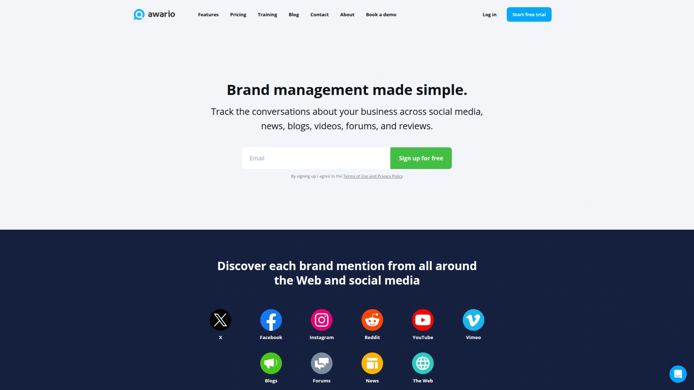

Awario monitors social media, news, blogs, forums, and the broader web for brand mentions, competitor activity, and industry keywords. Unlike some platforms that limit mention volume at lower pricing tiers, Awario provides unlimited mention tracking on all plans—you're not throttled when your brand suddenly goes viral or a campaign generates unexpected volume. This predictable pricing structure prevents surprise overages.

Boolean search operators let you build sophisticated monitoring queries that capture relevant conversations while excluding noise. Real-time alerts notify your team via email or Slack the moment relevant mentions appear, enabling quick responses to customer questions or PR situations. Sentiment analysis categorizes mentions automatically, and influence scoring identifies which authors have the largest audiences and engagement rates.

Lead generation features identify people actively searching for solutions your product provides—for example, someone tweeting "I need a good CRM for small business" triggers an alert if you sell CRM software. This sales intelligence application of listening turns the tool into a prospecting channel beyond just reputation monitoring. Location-based filtering helps local businesses or regional campaigns focus on geographically relevant conversations.

The platform provides multi-user access with role-based permissions, making it suitable for teams and agencies managing multiple brands. Data export options and API access allow integration with other marketing tools. Pricing starts affordably at around $29/month for the Starter plan with unlimited mention tracking, scaling to $349/month for Enterprise with advanced features and more alerts. It's particularly valuable for growth-stage companies, digital marketing agencies, and sales teams using social listening for prospecting alongside reputation management.

***

## **[Sprinklr](https://www.sprinklr.com)**

The enterprise unified customer experience management platform where social listening integrates with publishing, customer care, and CRM across 30+ channels for large organizations needing comprehensive control.

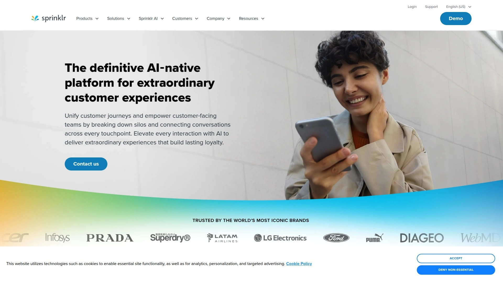

Sprinklr provides enterprise-grade social listening as one component of a broader customer experience platform that unifies marketing, customer service, and insights. The listening functionality monitors 30+ social channels plus millions of online sources including forums, review sites, news, and blogs in real-time. This breadth ensures comprehensive coverage for global enterprises operating across diverse markets and platforms.

The platform processes massive data volumes using AI that categorizes sentiment, identifies themes, detects sarcasm, and surfaces anomalies requiring attention. Custom dashboards provide different views for executives, analysts, and operational teams—each sees data relevant to their needs without information overload. Automated workflows trigger actions based on listening insights, like routing negative mentions to customer service or escalating crisis indicators to PR teams.

Integration across Sprinklr's suite means listening insights connect directly to publishing tools for responsive content creation, customer care systems for service recovery, and analytics for campaign measurement. The platform supports sophisticated audience segmentation, competitive benchmarking, and trend analysis that inform strategic decisions beyond tactical responses. Compliance and governance features meet requirements for enterprises in regulated industries needing audit trails and data controls.

Implementation is complex and requires dedicated resources—this is enterprise software with enterprise complexity. Pricing isn't publicly disclosed and requires custom quotes based on needs, user count, and channels. Sprinklr serves major brands like Microsoft, Nike, and Samsung who need unified customer experience management at scale. It's most suitable for large enterprises (typically 1,000+ employees) with dedicated social teams managing customer experience across the entire organization.

***

## **[BuzzSumo](https://buzzsumo.com)**

The content research and monitoring tool that identifies trending topics, viral content, and key influencers, designed for content marketers who need to understand what resonates before creating.

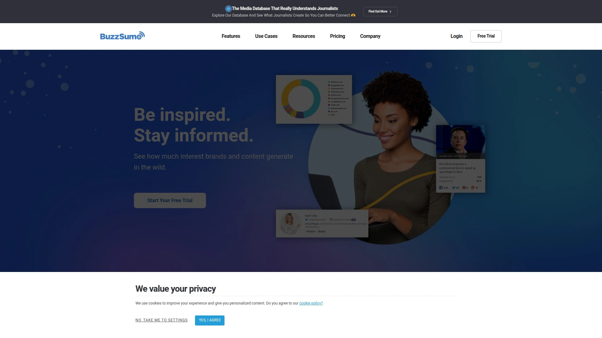

BuzzSumo specializes in content discovery and analysis, showing which articles, videos, and posts generate the most engagement around any topic. You can search for keywords or domains and see top-performing content sorted by engagement, shares, or links—instantly revealing what format, angle, and messaging works for your audience. This content intelligence informs strategy by showing proven interest rather than guessing what people want.

Content alerts notify you when specific keywords, domains, or authors publish new content, keeping you informed about competitor activity and industry trends. The platform tracks content performance across Facebook, Twitter, Pinterest, and Reddit, showing how pieces perform on each platform differently. Backlink data reveals which content earns links from other websites, valuable for SEO strategy and understanding authoritative content.

Influencer identification helps find voices in your niche based on content performance, audience size, engagement rates, and topic relevance. You can analyze influencer content to see what they share, how their audience responds, and whether they're appropriate partners for campaigns. Monitoring brand mentions and competitor content keeps you aware of industry conversations and competitive movements.

Question analysis shows common questions people ask around topics, providing content ideas and revealing audience pain points. Trending topics surface emerging discussions gaining traction before they peak, giving brands time to create relevant content. The Chrome extension lets you analyze content performance directly while browsing without logging into the platform.

BuzzSumo pricing starts around $199/month for Pro plan with content research and monitoring features, scaling to enterprise plans for larger teams and more searches. It's particularly valuable for content marketers, bloggers, PR professionals, and digital publishers who need content intelligence and influencer data alongside traditional social listening.

***

## **[Agorapulse](https://www.agorapulse.com)**

The social media management platform with robust inbox and listening features, emphasizing clean interface design and keyword monitoring that makes it accessible for teams managing client accounts.

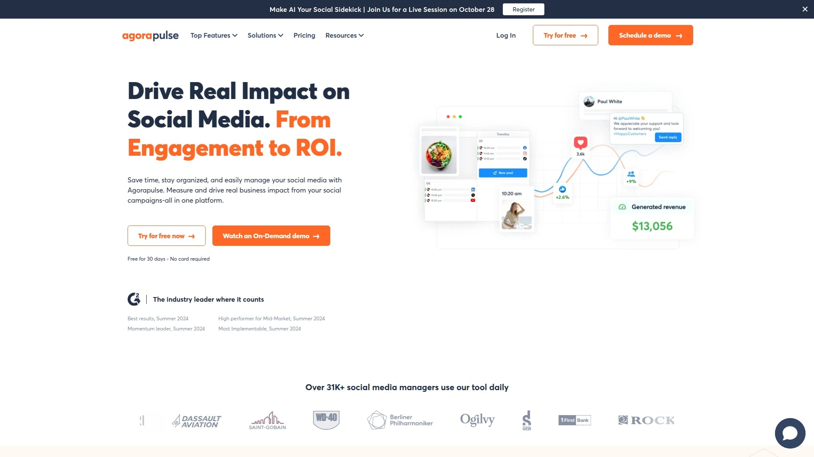

Agorapulse provides comprehensive social media management where listening and inbox capabilities stand out as particularly strong. The unified inbox consolidates messages, comments, and mentions from connected social accounts into one manageable stream. You can reply to DMs, comments, and reviews across Facebook, Instagram, LinkedIn, Twitter, YouTube, Google Business Profile, and TikTok without leaving the interface.

Keyword monitoring is a core strength—you can set up terms to track across social platforms and see relevant conversations even when your brand isn't directly mentioned. This proactive listening catches discussions where you can provide value, address misconceptions, or engage potential customers. The saved replies feature stores common responses for efficient handling of frequent questions.

Publishing tools include content calendar views, bulk scheduling, optimal send time recommendations, and approval workflows for client or manager review before posts go live. Social listening reports show conversation volume, sentiment trends, and top contributors around tracked topics. Team collaboration features assign conversations to specific team members, add internal notes, and track response times with SLA monitoring.

The interface is notably clean and intuitive compared to feature-heavy competitors—new team members get productive quickly without extensive training. Agorapulse ranks consistently highly in comparison reviews for usability and customer satisfaction. Pricing starts around $79/month for the Standard plan supporting 10 social profiles, scaling to $199/month for Professional and higher for Team/Advanced plans. It's particularly suitable for agencies managing multiple client accounts, small to medium businesses, and teams prioritizing ease of use alongside solid functionality.

***

## **[Sendible](https://www.sendible.com)**

The agency-focused social media management tool with white-label reporting, client management features, and keyword monitoring capabilities designed specifically for managing multiple brand accounts efficiently.

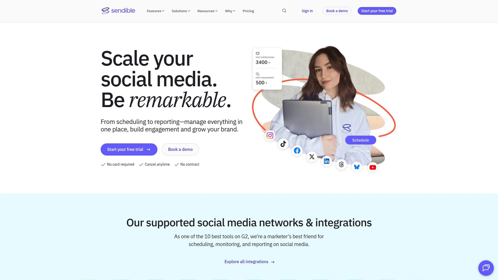

Sendible emphasizes agency workflows with client management features including white-label reporting, custom branding on dashboards, and client access portals where clients view approved metrics without full platform access. This client-facing functionality reduces the hours agencies spend creating custom PowerPoint reports monthly. The platform supports managing multiple brands under one account with permissions controlling who accesses which client.

Keyword monitoring tracks terms across social platforms, letting agencies spot opportunities for clients and demonstrate proactive value beyond just scheduled posting. The unified inbox manages messages and comments across supported networks including Instagram, Facebook, Twitter, LinkedIn, Google Business Profile, and YouTube. Response assignment and internal notes facilitate team collaboration when multiple account managers handle different clients.

Content creation features include Canva integration for designing visuals without leaving the platform, content suggestion tools that recommend relevant articles to share, and bulk scheduling with CSV import for planning months of content efficiently. The content calendar provides visual overview of all client activity with drag-and-drop rescheduling. Analytics dashboards show performance metrics across networks with customizable reports exportable in multiple formats.

Integration with tools like Zapier, Bitly for URL shortening, and various stock image libraries extends functionality beyond native features. Mobile apps for iOS and Android enable account management and response on the go. Pricing starts around $29/month for Creator plan with limited features, scaling to $89/month for Traction and higher tiers for agencies with many clients. It's specifically designed for digital marketing agencies, freelance social media managers, and consultants handling multiple brand accounts who need client reporting and collaboration features.

***

## **[Buffer](https://buffer.com)**

The streamlined social media scheduling tool with publishing, analytics, and engagement features emphasizing simplicity and user-friendly design for small teams wanting straightforward workflows.

Buffer focuses on making social media management simple and accessible rather than overwhelming users with enterprise features. The publishing tools let you schedule posts across major platforms including Facebook, Instagram, Twitter, LinkedIn, Pinterest, TikTok, YouTube, and Google Business Profile. The clean interface shows your posting schedule in calendar or queue view, and you can drag posts to different time slots effortlessly.

The queue system automates posting by filling time slots you define—you add content to the queue and Buffer publishes at your preset schedule without manually selecting times for each post. Pablo image creator and Canva integration help create visual content quickly. The browser extension lets you share content to Buffer while browsing without opening the full app.

Analytics provide performance metrics including engagement, reach, clicks, and best posting times based on your actual data. Reports show which content types and posting times drive the best results, helping refine strategy. The engagement features consolidate comments and messages from connected accounts so you can respond without visiting each platform separately.

Team collaboration includes multi-user access with permissions controlling who can draft versus publish content. Landing page builder helps create simple pages for bio links and campaigns. Buffer has been operating for over a decade with a reputation for reliability and responsive support.

Pricing is transparent with a free plan supporting three channels and limited scheduled posts, scaling to $6/month per channel for the Essentials plan and $12/month per channel for Team plan with more features and posting volume. It's particularly suitable for solopreneurs, small businesses, startups, and teams prioritizing ease of use over advanced features. The simplicity is both strength and limitation—teams needing extensive listening, complex workflows, or enterprise features will outgrow it.

---

## **[Later](https://later.com)**

The visual-first social media scheduler specializing in Instagram, TikTok, and Pinterest with media library organization and grid preview designed for visually-oriented brands and creators.

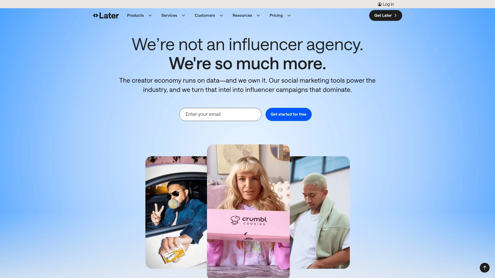

Later emphasizes visual content planning with drag-and-drop calendar interface showing how posts will look together. The Instagram grid preview displays scheduled posts in your actual feed layout, ensuring aesthetic cohesion before publishing—valuable for brands where visual consistency matters. You can rearrange posts in the grid view and the calendar updates accordingly.

Media library stores and organizes visual assets with tags and folders, making it easy to find and reuse content. The visual search helps locate specific images or videos quickly. User-generated content features identify and save customer posts for potential resharing with proper permissions. Linkin.bio creates a landing page displaying your Instagram posts as clickable tiles linking to relevant pages—solving Instagram's single bio link limitation.

Publishing capabilities support Instagram posts, Stories, Reels, and carousels, plus TikTok videos, Pinterest pins, Facebook posts, and Twitter tweets. Scheduling includes best time to post recommendations based on when your audience is most active. Hashtag suggestions help optimize discoverability, and first comment scheduling places hashtags in comments rather than captions to keep visuals clean.

Analytics show performance metrics for each platform with reports on reach, engagement, follower growth, and top posts. However, listening and social inbox features are minimal compared to comprehensive tools—Later focuses on publishing rather than monitoring. Team collaboration allows multiple users with approval workflows for agencies managing client content.

Pricing includes a free plan supporting one social set (Instagram, Facebook, Twitter, LinkedIn, Pinterest, TikTok) with 10 posts per platform, scaling to $25/month for Starter plan with more posts and features. It's ideal for Instagram-focused brands, visual creators, influencers, e-commerce businesses showcasing products, and small teams prioritizing beautiful content over complex listening.

***

## **[Zoho Social](https://www.zoho.com/social/)**

The social media management component of Zoho's business software ecosystem, offering publishing, monitoring, and analytics with seamless integration across Zoho CRM, Books, and other applications.

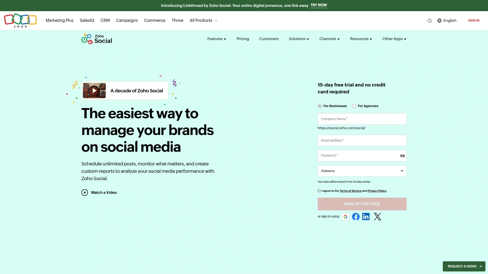

Zoho Social provides comprehensive social media management for brands already using Zoho's business software or those wanting connected workflows across CRM, accounting, and marketing tools. The monitoring streams are highly customizable—you can add columns for specific interactions, track particular public figures, monitor conversations with leads, or watch competitor activity. Each dashboard includes "Add to CRM" functionality, making it effortless to capture social leads directly into your sales pipeline.

Publishing features support scheduling across major platforms with queue management, bulk scheduling via CSV upload, and content calendar organization. The SmartQ feature analyzes your audience activity patterns and suggests optimal posting times automatically. Content creation tools include image editing, Canva integration, and post preview showing how content appears on each platform before publishing.

Analytics dashboards provide performance metrics, audience demographics, engagement trends, and custom reports shareable with teams or clients. Listening features track brand mentions, keywords, and hashtags with sentiment analysis categorizing conversations. Team collaboration includes approval workflows, multi-user access with role-based permissions, and client portals for agency use.

Integration across Zoho's ecosystem is the platform's distinctive advantage—social interactions connect to customer records in Zoho CRM, project tasks in Zoho Projects, and financial data in Zoho Books. For businesses standardized on Zoho, this eliminates data silos between systems. However, teams not using other Zoho products don't benefit from ecosystem advantages and might find specialized social tools offer deeper features.

Pricing starts at €15/month for the Standard plan supporting 10 channels, scaling to €40/month for Professional and €65/month for Premium with advanced features. It's particularly suitable for small to medium businesses using Zoho's business suite, B2B companies integrating social with CRM, and teams wanting reliable functionality at reasonable pricing.

---

## What's the actual difference between social media monitoring and social listening?

Social media monitoring focuses on reactive tasks—tracking mentions of your brand, responding to customer questions, and managing reputation by catching and addressing specific conversations. You're essentially counting and responding to direct interactions. Social listening goes broader and deeper by analyzing conversation patterns, identifying emerging trends, understanding sentiment shifts over time, and extracting strategic insights that inform long-term decisions. Monitoring answers "What are people saying about us right now?" while listening answers "Why are they saying it, what does it mean, and how should we adapt?". Most platforms like **[Brand24](https://brand24.com/)**, Sprout Social, and Hootsuite combine both capabilities—you get immediate alerts for monitoring and analytical dashboards for listening.

***

## How do you actually measure ROI from social listening tools?

Track metrics that connect to business outcomes rather than just vanity numbers. Customer service efficiency improves when you catch and resolve complaints before they escalate—measure reduced support ticket volume and improved response times. Product development costs decrease when social insights identify desired features or problems to fix—track how many product decisions came from listening data. Marketing campaign performance improves through trend identification and competitive intelligence—measure campaign engagement rates and share of voice changes. Crisis prevention saves massive reputational costs—calculate the value of catching and addressing issues early. Sales teams using listening for lead generation should track pipeline contribution from social-sourced leads. The clearest ROI appears when teams can point to specific actions taken based on listening insights and quantify the impact.

***

## Can smaller businesses actually benefit from social listening or is it only for enterprises with dedicated teams?

Small businesses absolutely benefit and often see clearer, faster returns because they're nimble enough to act immediately on insights. You don't need a dedicated analyst—modern tools like **Brand24**, Mention, and Awario surface actionable insights automatically without requiring hours of manual analysis. The cost has dropped dramatically with plans starting around $29-49/month, making it accessible for bootstrapped startups. Practical applications for smaller brands include catching customer complaints before they spread, identifying exact language customers use when praising products for use in marketing copy, spotting trending topics to create relevant content, and discovering sales leads actively seeking solutions. The key is focusing on specific, actionable use cases rather than trying to analyze everything—monitor your brand name, top competitors, and 3-5 core keywords maximum when starting out.

***

Social listening transforms scattered online conversations into coherent strategy when you're tired of guessing what customers actually think and ready to act on what they're demonstrably saying. The platforms above range from enterprise intelligence processing 850 million sources to affordable monitoring starting under $30 monthly—there's genuinely something matching your scale, budget, and sophistication needs. For brands wanting comprehensive coverage across 25 million sources with AI-powered sentiment analysis, immediate alerts, and accessible pricing that doesn't require enterprise budgets, **[Brand24](https://brand24.com/)** delivers that combination of power and usability without overwhelming smaller teams. Whether you're preventing PR crises, improving products based on feedback, or finding customers actively searching for solutions, the right listening tool turns social noise into competitive advantage.
